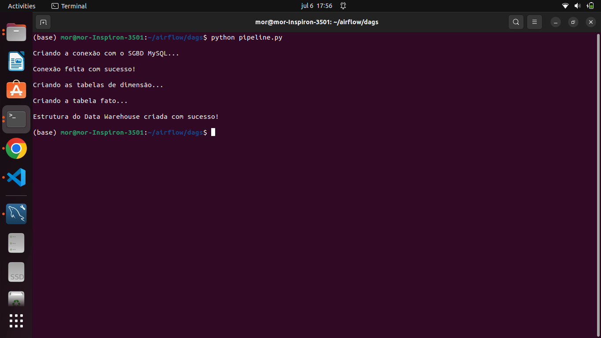
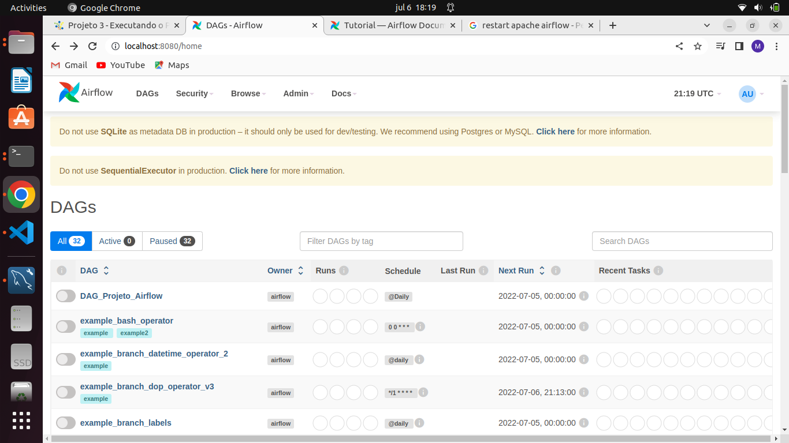
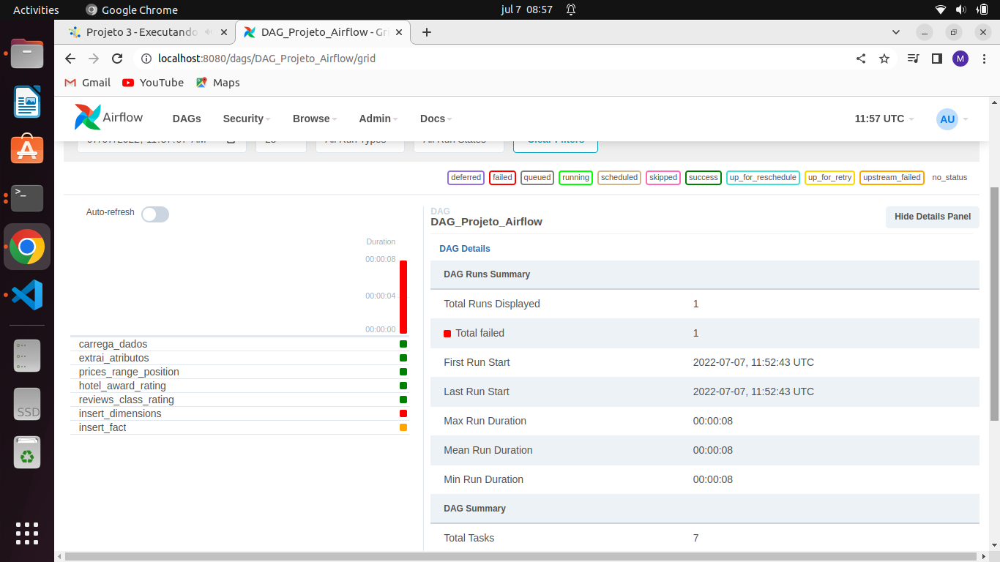
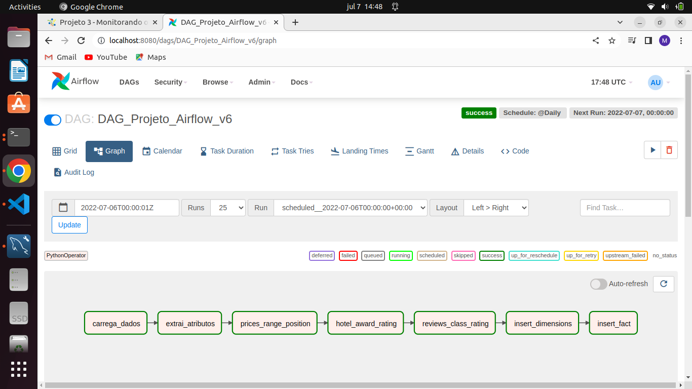
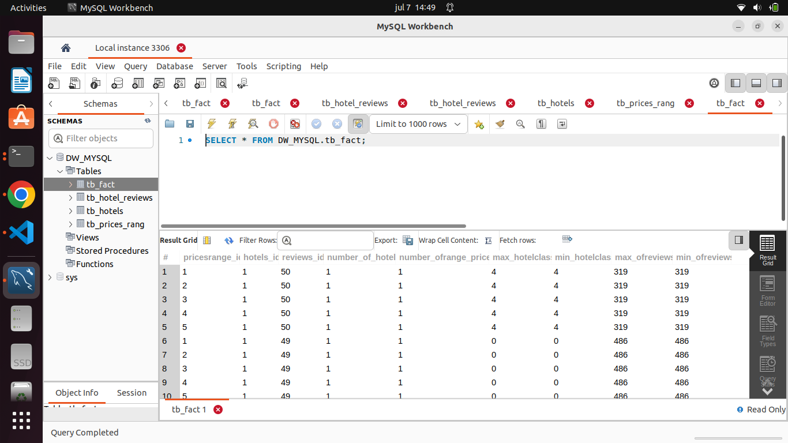
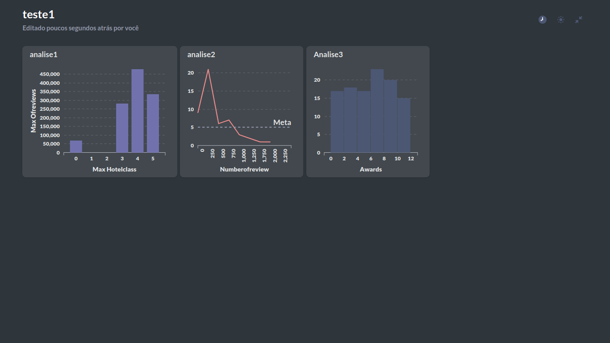

##Pipeline de Carga e Análise de Dados do Data Warehouse com Apache Airflow e o Metabase

  * #### __Objetivo__

##### O objetivo deste projeto é criar um pipeline para a carga e análise de dados em um Data Warehouse utilizando o Apache Airflow e analisar esses dados com o Metabase.

* #### __Configuração__

##### Para este projeto utilizei minha máquina local com Linux Ubuntu 22.04. O primeiro passo foi instalar o Python 3 (Ananconda). O próximo passo foi a instalação do Apache Airflow 2.3.2, seguindo as instruções da documentação do mesmo. Por último criei uma conta no Metabase.

* #### __Problema de Negócio__

##### Utilizando uma base de dados contendo informações sobre hotéis, iremos construir um pipeline para auxiliar a área de negócios com as classificações e avaliações dos hotéis.

* #### __Os Dados__

##### Os dados estão no formato JSON e foram extraídos do portal TripAdvisor. Os dados contém informações como número de estrelas, avaliações e outros dados relevantes.

* #### __O Procedimento__

##### O pipeline em Python irá ler o arquivo no formato JSON e realizar uma série de processamentos. Os resultados oriundos desses processamentos ficarão em uma área de stage, isto é uma área intermediária antes do Data Warehouse. Por falar em DW, usaremos o Mysql como um Data Warehouse nesse projeto.
##### Terminada essa parte intermediária, os dados serão carregados no DW já no formato CSV.

* #### __Execução do Projeto__

##### Após a instalação do Anacanda e do Apache Airflow foi a vez de instalar o MySQL e o MySQL Workbench. Para não utlizar o usuário root o usuário projeto foi criado também. Por fim, antes de iniciar o  projeto propriamente dito, foi necessário instalar o driver de conexão entre o python através do comando abaixo:

##### pip install mysql-connector-python

##### O próximo passo foi a criação do módulo Python conecta_db. Optei por fazer a crição das tabelas dimensões e fato por esse script Python. Em seguida veio a parte mais complexa, que é o pipeline em Python que faz a transformação dos dados do formato json para um formato tabular e em seguida faz a carga no DW. Por fim cria as dags e cria a ordem de excução das mesmas.
##### Aqui vale a pena salientar que ao executar o pipeline pela primeira vez nenhuma tabela é carregada no DW, o que ocorre nesta primeira run é um processo de validação. As duas próximas figuras mostram a validação feita e a dag criada.

##### Ao executar a dag ocorreram alguns erros, o primeiros foram erros de sintaxe no mysql, esses erros foram facilmente resolvidos. Porém ao executar a dag novamente outro erro ocorreu. Desta vez foi na task de número 6, não estava conseguindo fazer o TRUNCATE nas tabelas devido as foreing keys. Como mostra a figura abaixo.

##### Para resolver esse problema desativei a checagem da foreign key e após o bloco inserção eu ativei novamente.
##### Finalmente consegui fazer a execução da dag sem erros, a figura abaixo mostra a dag (versão 6) executada com sucesso.

##### Os dados foram carregados corretamente no DW, como mostra a figura abaixo.

##### Por fim foi a vez de usar o Metabase para carregar os dados e fazer algumas análises. Vale a pena mencionar que foi a primeira vez que tive contato com o Metabase. Me agradou basante a ferramenta. Todo o processo, desde o carregamento até as análises foi bem intuitivo e fácil. A figura abaixo mostra algumas das análises feitas.

* #### __Conclusão__

##### O projeto foi o meu primeiro contato com o Apache Airflow. Foi um desafio que gerou muito aprendizado, tanto na parte teórica quanto na prática. 
##### Meu próximo passo será me aprofundar mais no Apache Airflow, pois agora entendo sua importância para a Engenharia de Dados.

